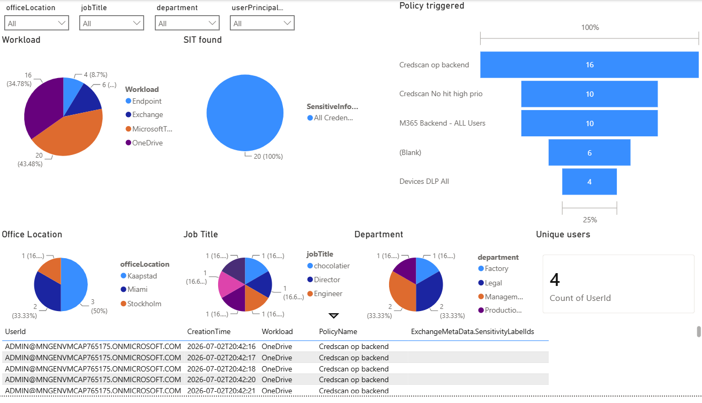
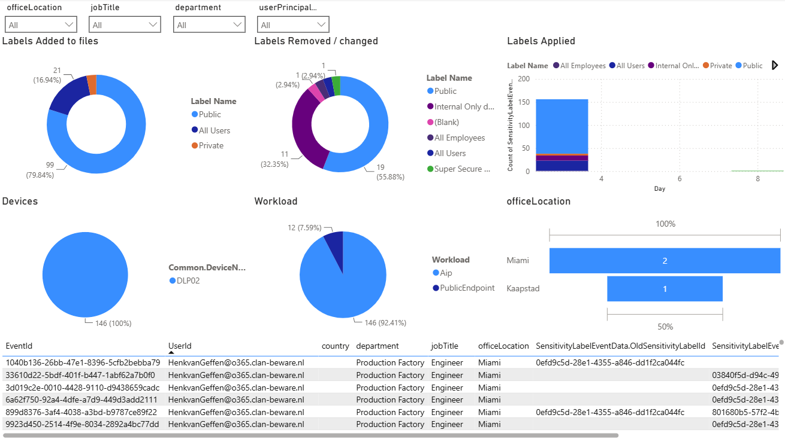
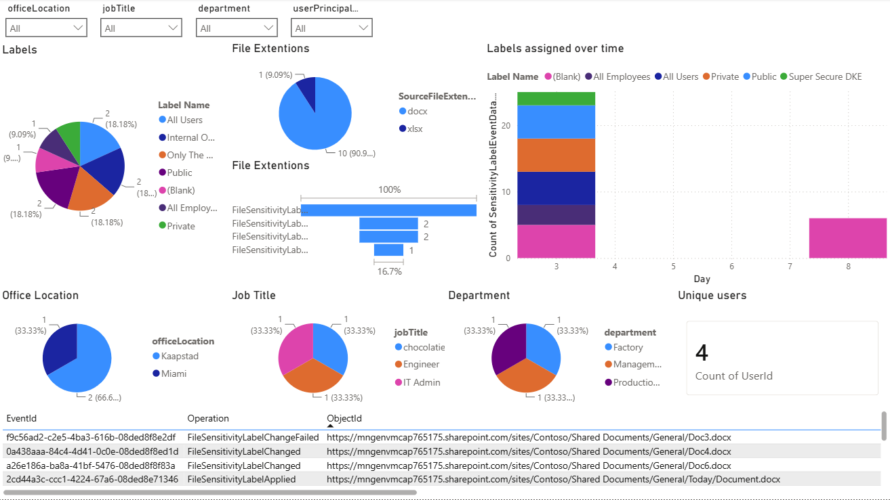
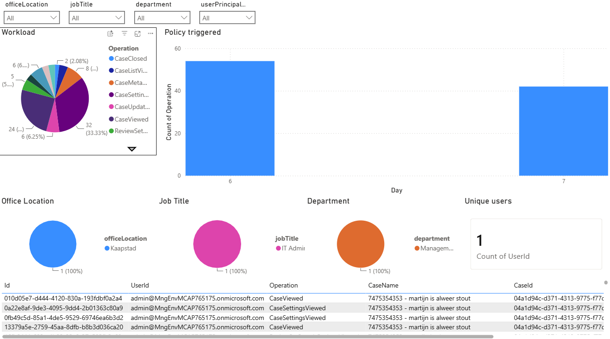

## Let me know in the discussions if you like this project , if you have improvement ideas, or just say hello if you deployed PRISM in your environment and what you experience is with the tool


# PRISM — Purview Reporting & Insights System for Metadata

PRISM ingests Microsoft 365 audit data (Exchange, SharePoint, DLP, General, and
Azure Active Directory) and a daily
Entra users snapshot into an Azure Data Lake for Power BI reporting. It is
deployed as a **self-contained, deploy-your-own-instance** template: every
organization provisions its own isolated stack in its own subscription.

> This is **not** a multi-tenant SaaS. Each deployment serves a single tenant.

## Architecture

Azure Function Apps land data into per-workload Event Hubs, which are drained by
Stream Analytics jobs into a single Data Lake (Gen2) whose public access is
governed by a **Network Security Perimeter (NSP)**. Which audit
workloads deploy is controlled by the `enabledWorkloads` parameter
(`infra/main.parameters.json`) — each entry provisions its own Function App,
Event Hub, Stream Analytics job, and role assignments. Secrets are stored in Key
Vault and read via managed identity. See
[docs/solution-proposal.md](docs/solution-proposal.md) for the full design and
[docs/cost-proposal.md](docs/cost-proposal.md) for cost estimates.

## Documentation

Detailed guidance lives in the [`docs/`](docs/) folder:

| Chapter | Description |
|---------|-------------|
| [Deployment guide](docs/deploy.md) | Prerequisites, Entra app registration, `azd up`, choosing audit workloads, starting the audit subscriptions and the Stream Analytics job, and the full configuration reference. |
| [Power BI reporting guide](docs/powerbi.md) | Importing the M queries (or the `.pbit` template), model relationships, and incremental refresh. |
| [MCP over the Data Lake](docs/mcp-datalake.md) | Add AI/MCP natural-language querying over the audit lake — Azure MCP Server (Option A) and Microsoft Fabric Data Agent (Option C). |
| [Solution proposal](docs/solution-proposal.md) | End-to-end architecture and the Azure resources created. |
| [Cost proposal](docs/cost-proposal.md) | Estimated monthly Azure cost and per-workload cost impact. |
| [PRISM vs. MPARR](docs/prism-vs-mparr.md) | How PRISM compares to Microsoft's MPARR collector on cost, implementation, maintenance, and flexibility. |
| [Todo](docs/Todo.md) | Outstanding documentation and roadmap items. |

## Quick start

Follow the [Deployment guide](docs/deploy.md) to provision an instance, then see
[Power BI reporting](#power-bi-reporting) below to build the report. In short:

```pwsh
azd auth login
azd env new prism
azd env set AZURE_LOCATION      westeurope
azd env set ENTRA_TENANT_ID     <your-tenant-guid>
azd env set ENTRA_CLIENT_ID     <your-app-client-guid>
azd env set ENTRA_CLIENT_SECRET <your-app-secret>      # never committed
azd up
```

After `azd up`, run the [webhook bootstrap scripts](docs/deploy.md#start-the-audit-subscriptions-createwebhooks)
and [start the Stream Analytics job](docs/deploy.md#start-the-stream-analytics-job)
once. See the [Deployment guide](docs/deploy.md) for the complete steps.

## Power BI reporting

The `PBI-Mquerys/` folder contains the Power Query (M) definitions that build the
reporting model over the Data Lake. The
[Power BI reporting guide](docs/powerbi.md) covers two ways to get started:

- **Build from scratch** — import the M queries manually and wire up the model
  relationships yourself, for full control over the reporting model.
- **Use the `PRISM.pbit` template** — a ready-made starting draft with all queries,
  load settings, and relationships pre-configured, which you can build upon. It is a
  **sample**: depending on your reporting use case you may need to reconfigure or
  rebuild the relationships, add or remove sub-tables, and adjust which queries load.

See the guide for prerequisites, both options in detail, the model relationships,
and incremental refresh.

### Sample report gallery

The screenshots below are pages from the included `PRISM.pbit` sample report,
built entirely on the audit data PRISM lands in the Data Lake. Every page slices
the same model by **office location, job title, department, and user**, and drills
down to the raw audit records in a detail table — showing how the collected
Microsoft 365 signals become interactive, filterable insights.

#### Data Loss Prevention (DLP)

Which **policies triggered**, the **sensitive information types** detected, and the
**workloads** involved (Endpoint, Exchange, Teams, OneDrive) — with per-user and
per-department breakdowns and the underlying DLP events.



#### Sensitivity labels (Microsoft Information Protection)

**Labels added, removed, or changed** on files over time, broken down by label
name, device, and workload — tracking sensitivity-label activity across the tenant.



#### Auto-labeling & label changes

**Sensitivity-label operations** (applied, changed, change-failed) by file type and
over time, drilling into the exact SharePoint/OneDrive documents affected.



#### eDiscovery

**eDiscovery case activity** — case viewed, updated, settings changed, review-set
operations — trended by day with per-case and per-user detail.



## Security notes

- **Never commit secrets.** `.env`, `local.settings.json`, and `.azure/**` are
  git-ignored. Provide the client secret only via `azd env set`.
- Secrets live in **Key Vault**; Function Apps read them via **managed identity**.
- The Data Lake's public network access is **secured by a Network Security
  Perimeter** (`publicNetworkAccess: 'SecuredByPerimeter'`). Inbound public
  access is denied by default; the perimeter allows only the report-author /
  gateway IPs from `DATA_LAKE_ALLOWED_IPS` (empty by default — never open it
  broadly) plus in-subscription Azure services (the Stream Analytics job). The
  report-author IP rule is applied by the **azd postprovision hook**
  ([`scripts/set-datalake-nsp-ip-rule.ps1`](scripts/set-datalake-nsp-ip-rule.ps1)),
  because the NSP provider cannot write an IP rule and a subscription rule in the
  same ARM deployment. The `entrausers` function reaches the lake over its
  **private endpoint**, which the perimeter always permits without a rule.
- No tenant-specific defaults are baked into the templates; all identity values
  are supplied at deploy time.

## Configuration reference

The full list of deploy-time settings and Bicep parameters is documented in the
[Deployment guide → Configuration reference](docs/deploy.md#configuration-reference).
