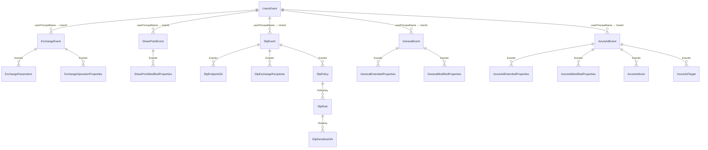

# PRISM — Purview Reporting & Insights System for Metadata

PRISM ingests Microsoft 365 audit data (Exchange, SharePoint, DLP, General, and
Azure Active Directory) and a weekly
Entra users snapshot into an Azure Data Lake for Power BI reporting. It is
deployed as a **self-contained, deploy-your-own-instance** template: every
organization provisions its own isolated stack in its own subscription.

> This is **not** a multi-tenant SaaS. Each deployment serves a single tenant.

## Architecture

Azure Function Apps land data into per-workload Event Hubs, which are drained by
Stream Analytics jobs into a single firewalled Data Lake (Gen2). Which audit
workloads deploy is controlled by the `enabledWorkloads` parameter
(`infra/main.parameters.json`) — each entry provisions its own Function App,
Event Hub, Stream Analytics job, and role assignments. Secrets are stored in Key
Vault and read via managed identity. See
[docs/solution-proposal.md](docs/solution-proposal.md) for the full design and
[docs/cost-proposal.md](docs/cost-proposal.md) for cost estimates.

## Prerequisites

- [Azure Developer CLI (`azd`)](https://learn.microsoft.com/azure/developer/azure-developer-cli/install-azd)
- [Azure CLI (`az`)](https://learn.microsoft.com/cli/azure/install-azure-cli) with Bicep
- Python 3.11+
- An Azure subscription with permission to create resource groups and role assignments
- A **shared Entra app registration** (see below)

### Entra app registration (manual, one-time)

This template does **not** create the app registration. Before deploying, create
one app registration in your tenant and grant admin consent for:

- **Office 365 Management API**: `ActivityFeed.Read`, `ActivityFeed.ReadDlp` (application)
- **Microsoft Graph**: `User.Read.All` (application)

Record the **tenant id**, **client id**, and a **client secret**.

## Deploy

```pwsh
# 1. Authenticate
azd auth login

# 2. Create an environment (this becomes the resource group name suffix)
azd env new prism

# 3. Provide configuration (see .env.sample for the full list)
azd env set AZURE_LOCATION       westeurope
azd env set ENTRA_TENANT_ID      <your-tenant-guid>
azd env set ENTRA_CLIENT_ID      <your-app-client-guid>
azd env set ENTRA_CLIENT_SECRET  <your-app-secret>      # never committed

# Optional: allow your current public IP through resource firewalls to deploy
azd env set DEPLOYER_IP_ADDRESS  <your-public-ip>

# 4. Provision infrastructure and deploy the functions
azd up
```

After deployment, run the webhook bootstrap scripts (`createwebhooks/`) once to
start the Office 365 Management API subscriptions (see below).

## Start the audit subscriptions (`createwebhooks/`)

The Office 365 Management API only pushes audit content once a subscription is
started for each content type. Run the scripts in `createwebhooks/` **once**
after `azd up` (and again if a subscription is ever stopped). Run only the
scripts for the workloads you enabled in `enabledWorkloads`:

| Script | Content type | Webhook env var |
|--------|--------------|-----------------|
| `CreateWebhookSubscription1.ps1` | `Audit.Exchange` | `EXCHANGE_WEBHOOK_URL` |
| `CreateWebhookSubscription2.ps1` | `Audit.SharePoint` | `SHAREPOINT_WEBHOOK_URL` |
| `CreateWebhookSubscription3.ps1` | `DLP.All` | `DLP_WEBHOOK_URL` |
| `CreateWebhookSubscription4.ps1` | `Audit.General` | `GENERAL_WEBHOOK_URL` |
| `CreateWebhookSubscription5.ps1` | `Audit.AzureActiveDirectory` | `AZUREAD_WEBHOOK_URL` |

The scripts read **all** values from environment variables — nothing is hard-coded.
Get each Function App's webhook URL (including its `?code=` function key) from the
Azure portal (Function App → Functions → `webhook` → Get function URL) or from your
deployment outputs.

```pwsh
# Same app registration values used for the deployment
$env:PURVIEW_TENANT_ID     = "<your-tenant-guid>"
$env:PURVIEW_CLIENT_ID     = "<your-app-client-guid>"
$env:PURVIEW_CLIENT_SECRET = "<your-app-secret>"      # never committed

# Each Function App's full webhook URL, including the ?code=<function-key>
$env:EXCHANGE_WEBHOOK_URL   = "https://<exchange-func>.azurewebsites.net/api/webhook?code=<key>"
$env:SHAREPOINT_WEBHOOK_URL = "https://<sharepoint-func>.azurewebsites.net/api/webhook?code=<key>"
$env:DLP_WEBHOOK_URL        = "https://<dlp-func>.azurewebsites.net/api/webhook?code=<key>"
$env:GENERAL_WEBHOOK_URL    = "https://<general-func>.azurewebsites.net/api/webhook?code=<key>"
$env:AZUREAD_WEBHOOK_URL    = "https://<azuread-func>.azurewebsites.net/api/webhook?code=<key>"

# Run each once — a 200 with a "status: enabled" subscription confirms success
./createwebhooks/CreateWebhookSubscription1.ps1
./createwebhooks/CreateWebhookSubscription2.ps1
./createwebhooks/CreateWebhookSubscription3.ps1
./createwebhooks/CreateWebhookSubscription4.ps1
./createwebhooks/CreateWebhookSubscription5.ps1
```

> The Function App keys in `*_WEBHOOK_URL` are secrets — set them only as
> environment variables for the current session; never commit them.

## Power BI reporting

The `PBI-Mquerys/` folder contains the Power Query (M) definitions that build the
reporting model over the Data Lake. Each file is **one query**; the queries
reference each other **by name**, so names must match the file names exactly.

### 1. Prerequisites

- **Power BI Desktop** (latest).
- The report author's identity (or the gateway) has **Storage Blob Data Reader**
  (or Contributor) on the Data Lake.
- If the Data Lake firewall is enabled, the author's public IP is in
  `dataLakeAllowedIpAddresses`.
- Your deployment's storage account name (the `DATA_LAKE_ACCOUNT_NAME` output),
  e.g. `dlprismab12cd`.

### 2. Option A — use the PRISM template (recommended)

If a `PRISM.pbit` template is published with the release, this is the fastest path:

1. Double-click `PRISM.pbit` (or **File → Import → Power BI template**).
2. When prompted, enter the **`DataLakeAccountName`** parameter (storage account
   name only — no `https://`, no suffix).
3. Sign in to the storage source with an **Organizational account** when asked.
4. Make sure that you can connect to the Datalake Biceps deploy only 1 allowed IP. See deploy Variables.
5. **Refresh**. All queries, load settings, and relationships come pre-configured.

> See [Build the `.pbit` template](#5-build-the-pbit-template-maintainers) for how a
> maintainer produces this file once from the queries below.

### 3. Option B — import the M queries manually

1. **Create the parameter first.** In **Home → Transform data** (Power Query
   Editor), **New Source → Blank Query → Advanced Editor**, paste the contents of
   `PBI-Mquerys/DataLakeAccountName`, and rename the query to exactly
   `DataLakeAccountName`. Power BI recognises the `IsParameterQuery` annotation and
   treats it as a parameter. Set its **Current Value** to your storage account name.
   (Alternatively use **Manage Parameters → New**, Type = Text.)
2. **Add each remaining query.** For every other file in `PBI-Mquerys/`:
   **New Source → Blank Query → Advanced Editor**, paste the file's contents, and
   **rename the query to match the file name exactly** (e.g. `DlpStaging`,
   `DlpEvent`). Exact names are required because queries reference one another.
3. **Set Enable load** per the table below (right-click a query → **Enable load**).
4. **Close & Apply.** Sign in with an **Organizational account** if prompted for the
   Data Lake source.
5. Create the **relationships** in Model view (section 4).

#### Enable-load settings

| Query / group | Enable load | Why |
|---------------|-------------|-----|
| `DataLakeAccountName` | — (parameter) | Connection parameter, not a table. |
| `fnExpandAllRecords` | **OFF** | Helper function. |
| `ExchangeStaging`, `SharePointStaging`, `DlpStaging`, `GeneralStaging`, `AzureAdStaging`, `UsersStaging` | **OFF** | Shared base queries; parsed once, consumed by children. |
| `ExchangeEvent`, `ExchangeParameters`, `ExchangeOperationProperties` | **ON** | Exchange fact + children. |
| `SharePointEvent`, `SharePointModifiedProperties` | **ON** | SharePoint fact + child. |
| `DlpEvent`, `DlpEndpointSit`, `DlpExchangeRecipients`, `DlpPolicy`, `DlpRule`, `DlpSensitiveInfo` | **ON** | DLP fact + children. |
| `GeneralEvent`, `GeneralExtendedProperties`, `GeneralModifiedProperties` | **ON** | Audit.General fact + children. |
| `AzureAdEvent`, `AzureAdExtendedProperties`, `AzureAdModifiedProperties`, `AzureAdActor`, `AzureAdTarget` | **ON** | Audit.AzureActiveDirectory fact + children. |
| `UsersEvent` | **ON** | Entra users fact. |

### 4. Relationships

In **Model view**, create these relationships (This is a example, you might need other mapping based on you reporting needs.!!). All are **one-to-many**
(1 → \*) with **single** cross-filter direction, from the parent (the `1` side)
to the child, and **active**.

| Parent (1) · key | Child (\*) · key | Cardinality |
|------------------|------------------|-------------|
| `ExchangeEvent[EventId]` | `ExchangeParameters[EventId]` | 1 → \* |
| `ExchangeEvent[EventId]` | `ExchangeOperationProperties[EventId]` | 1 → \* |
| `SharePointEvent[EventId]` | `SharePointModifiedProperties[EventId]` | 1 → \* |
| `DlpEvent[EventId]` | `DlpEndpointSit[EventId]` | 1 → \* |
| `DlpEvent[EventId]` | `DlpExchangeRecipients[EventId]` | 1 → \* |
| `DlpEvent[EventId]` | `DlpPolicy[EventId]` | 1 → \* |
| `DlpPolicy[PolicyKey]` | `DlpRule[PolicyKey]` | 1 → \* |
| `DlpRule[RuleKey]` | `DlpSensitiveInfo[RuleKey]` | 1 → \* |
| `GeneralEvent[EventId]` | `GeneralExtendedProperties[EventId]` | 1 → \* |
| `GeneralEvent[EventId]` | `GeneralModifiedProperties[EventId]` | 1 → \* |
| `AzureAdEvent[EventId]` | `AzureAdExtendedProperties[EventId]` | 1 → \* |
| `AzureAdEvent[EventId]` | `AzureAdModifiedProperties[EventId]` | 1 → \* |
| `AzureAdEvent[EventId]` | `AzureAdActor[EventId]` | 1 → \* |
| `AzureAdEvent[EventId]` | `AzureAdTarget[EventId]` | 1 → \* |
| `UsersEvent[userPrincipalName]` | `ExchangeEvent[UserId]` | 1 → \* |
| `UsersEvent[userPrincipalName]` | `SharePointEvent[UserId]` | 1 → \* |
| `UsersEvent[userPrincipalName]` | `DlpEvent[UserId]` | 1 → \* |
| `UsersEvent[userPrincipalName]` | `GeneralEvent[UserId]` | 1 → \* |
| `UsersEvent[userPrincipalName]` | `AzureAdEvent[UserId]` | 1 → \* |

`UsersEvent` is a shared **user dimension**: its `userPrincipalName` maps
one-to-many to each workload fact's `UserId`, so a single user filter slices
Exchange, SharePoint, DLP, General, and Azure AD together. The workload facts
(`ExchangeEvent`, `SharePointEvent`, `DlpEvent`, `GeneralEvent`, `AzureAdEvent`)
remain independent of one another (no direct cross-workload relationship) — they
are linked only through the shared `UsersEvent` dimension. Only build the
relationships for the workloads you actually enabled in `enabledWorkloads`.




## Security notes

- **Never commit secrets.** `.env`, `local.settings.json`, and `.azure/**` are
  git-ignored. Provide the client secret only via `azd env set`.
- Secrets live in **Key Vault**; Function Apps read them via **managed identity**.
- The Data Lake uses a **public endpoint with an IP allow-list**
  (`dataLakeAllowedIpAddresses`), empty by default. Only add the specific IPs of
  report authors / gateways that need read access — never open it broadly.
- No tenant-specific defaults are baked into the templates; all identity values
  are supplied at deploy time.

## Configuration reference

| Setting | Required | Description |
|---------|----------|-------------|
| `AZURE_LOCATION` | Yes | Azure region for all resources. |
| `ENTRA_TENANT_ID` | Yes | Tenant id of the shared app registration. |
| `ENTRA_CLIENT_ID` | Yes | Client id of the shared app registration. |
| `ENTRA_CLIENT_SECRET` | Yes | App client secret (deploy time only). |
| `DEPLOYER_IP_ADDRESS` | No | Public IP allowed through firewalls to deploy from outside the VNet. |
| `dataLakeAllowedIpAddresses` | No | Bicep param — IPs allowed to read the Data Lake. Empty by default. |
| `dataLakeUserPrincipalIds` | No | Bicep param — Entra object ids granted Data Lake read. Empty by default. |
