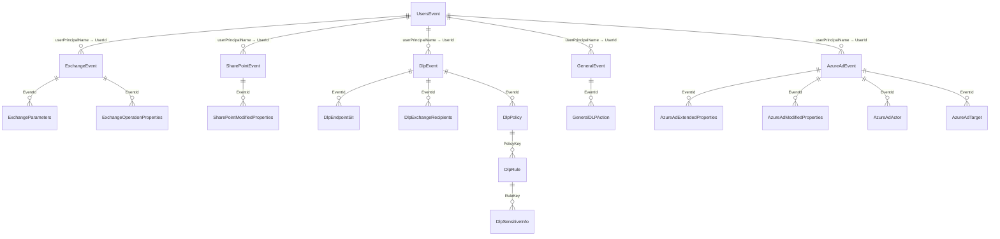

# PRISM — Power BI reporting

The `PBI-Mquerys/` folder contains the Power Query (M) definitions that build the
reporting model over the Data Lake. Each file is **one query**; the queries
reference each other **by name**, so names must match the file names exactly.

For provisioning the underlying Azure resources, see the
[Deployment guide](deploy.md).

## 1. Prerequisites

- **Power BI Desktop** (latest).
- The report author's identity (or the gateway) has **Storage Blob Data Reader**
  (or Contributor) on the Data Lake.
- The author's public IP is allowed inbound through the Data Lake's Network
  Security Perimeter via `DATA_LAKE_ALLOWED_IPS` (applied by the postprovision hook).
- Your deployment's storage account name (the `DATA_LAKE_ACCOUNT_NAME` output),
  e.g. `dlprismab12cd`.

## 2. Option A — use the PRISM template (recommended)

If a `PRISM.pbit` template is published with the release, this is the fastest path:

1. Double-click `PRISM.pbit` (or **File → Import → Power BI template**).
2. When prompted, enter the **`DataLakeAccountName`** parameter (storage account
   name only — no `https://`, no suffix).
3. Sign in to the storage source with an **Organizational account** when asked.
4. Make sure your public IP is allowed inbound through the Data Lake's Network
   Security Perimeter (`DATA_LAKE_ALLOWED_IPS`). See the
   [Deployment guide → Configuration reference](deploy.md#configuration-reference).
5. **Refresh**. All queries, load settings, and relationships come pre-configured.

> See [Build the `.pbit` template](#5-build-the-pbit-template-maintainers) for how a
> maintainer produces this file once from the queries below.

## 3. Option B — import the M queries manually

1. **Create the parameters first.** In **Home → Transform data** (Power Query
   Editor), **New Source → Blank Query → Advanced Editor**, paste the contents of
   `PBI-Mquerys/DataLakeAccountName`, and rename the query to exactly
   `DataLakeAccountName`. Power BI recognises the `IsParameterQuery` annotation and
   treats it as a parameter. Set its **Current Value** to your storage account name.
   (Alternatively use **Manage Parameters → New**, Type = Text.) Do the same with
   `PBI-Mquerys/LoadDays` (rename to exactly `LoadDays`, Type = Number) — it sets the
   rolling window of audit history to load, in days (default **360**). Every audit
   `*Staging` query reads only day-partition folders newer than today minus `LoadDays`,
   so refreshes scan a bounded window instead of the whole lake. (`UsersStaging` is a
   single overwritten snapshot and ignores it.)
2. **Add each remaining query.** For every other file in `PBI-Mquerys/`:
   **New Source → Blank Query → Advanced Editor**, paste the file's contents, and
   **rename the query to match the file name exactly** (e.g. `DlpStaging`,
   `DlpEvent`). Exact names are required because queries reference one another.
3. **Set Enable load** per the table below (right-click a query → **Enable load**).
4. **Close & Apply.** Sign in with an **Organizational account** if prompted for the
   Data Lake source.
5. Create the **relationships** in Model view (section 4).

### Enable-load settings

| Query / group | Enable load | Why |
|---------------|-------------|-----|
| `DataLakeAccountName` | — (parameter) | Connection parameter, not a table. |
| `LoadDays` | — (parameter) | Rolling window (days) of history to load; default 360. Not a table. |
| `fnExpandAllRecords` | **OFF** | Helper function. |
| `ExchangeStaging`, `SharePointStaging`, `DlpStaging`, `GeneralStaging`, `AzureAdStaging`, `UsersStaging` | **OFF** | Shared base queries; parsed once, consumed by children. |
| `ExchangeEvent`, `ExchangeParameters`, `ExchangeOperationProperties` | **ON** | Exchange fact + children. |
| `SharePointEvent`, `SharePointModifiedProperties` | **ON** | SharePoint fact + child. |
| `DlpEvent`, `DlpEndpointSit`, `DlpExchangeRecipients`, `DlpPolicy`, `DlpRule`, `DlpSensitiveInfo` | **ON** | DLP fact + children. |
| `GeneralEvent`, `GeneralDLPAction` | **ON** | Audit.General fact + child (`GeneralDLPAction` parses the JSON-encoded `NewValue` DLP-action detail). |
| `AzureAdEvent`, `AzureAdExtendedProperties`, `AzureAdModifiedProperties`, `AzureAdActor`, `AzureAdTarget` | **ON** | Audit.AzureActiveDirectory fact + children. |
| `UsersEvent` | **ON** | Entra users fact. |

## 4. Relationships

In **Model view**, create these relationships (This is a example, you might need other mapping based on you reporting needs.!!). All are **one-to-many**
(1 → \*) with **single** cross-filter direction, from the parent (the `1` side)
to the child, and **active**.

| Parent (1) · key | Child (\*) · key | Cardinality |
|------------------|------------------|-------------|
| `ExchangeEvent[EventId]` | `ExchangeParameters[EventId]` | 1 → \* |
| `ExchangeEvent[EventId]` | `ExchangeOperationProperties[EventId]` | 1 → \* |
| `SharePointEvent[EventId]` | `SharePointModifiedProperties[EventId]` | 1 → \* |
| `DlpEvent[EventId]` | `DlpEndpointSit[EventId]` | 1 → \* |
| `DlpEvent[EventId]` | `DlpExchangeRecipients[EventId]` | 1 → \* |
| `DlpEvent[EventId]` | `DlpPolicy[EventId]` | 1 → \* |
| `DlpPolicy[PolicyKey]` | `DlpRule[PolicyKey]` | 1 → \* |
| `DlpRule[RuleKey]` | `DlpSensitiveInfo[RuleKey]` | 1 → \* |
| `GeneralEvent[EventId]` | `GeneralDLPAction[EventId]` | 1 → \* |
| `AzureAdEvent[EventId]` | `AzureAdExtendedProperties[EventId]` | 1 → \* |
| `AzureAdEvent[EventId]` | `AzureAdModifiedProperties[EventId]` | 1 → \* |
| `AzureAdEvent[EventId]` | `AzureAdActor[EventId]` | 1 → \* |
| `AzureAdEvent[EventId]` | `AzureAdTarget[EventId]` | 1 → \* |
| `UsersEvent[userPrincipalName]` | `ExchangeEvent[UserId]` | 1 → \* |
| `UsersEvent[userPrincipalName]` | `SharePointEvent[UserId]` | 1 → \* |
| `UsersEvent[userPrincipalName]` | `DlpEvent[UserId]` | 1 → \* |
| `UsersEvent[userPrincipalName]` | `GeneralEvent[UserId]` | 1 → \* |
| `UsersEvent[userPrincipalName]` | `AzureAdEvent[UserId]` | 1 → \* |

`UsersEvent` is a shared **user dimension**: its `userPrincipalName` maps
one-to-many to each workload fact's `UserId`, so a single user filter slices
Exchange, SharePoint, DLP, General, and Azure AD together. The workload facts
(`ExchangeEvent`, `SharePointEvent`, `DlpEvent`, `GeneralEvent`, `AzureAdEvent`)
remain independent of one another (no direct cross-workload relationship) — they
are linked only through the shared `UsersEvent` dimension. Only build the
relationships for the workloads you actually enabled in `enabledWorkloads`.

## 5. (Optional) Incremental refresh — faster refreshes (Power BI Premium / PPU / Fabric)

By default every refresh re-reads the **entire** data lake, which gets slower as
history grows ("waiting for datalake storage"). Incremental refresh makes Power BI
re-read only the **most recent** daily partitions and leave older data untouched,
so refresh time stays flat. It requires **Power BI Premium, Premium-Per-User (PPU),
or Fabric** and the dataset **published to the service**.

**Prerequisite (query side).** The `*Staging` queries must filter their files on two
datetime parameters named exactly `RangeStart` and `RangeEnd`, derived from the
`yyyy/MM/dd` folder path (this pairs with the daily ASA output). This is **not wired
in the shipped queries yet** — ask a maintainer to enable it (or see the staging
pattern in the project notes) before configuring the policy below. Power BI's
incremental refresh only works when the parameters are consumed by a folded/pruning
filter, so history outside `[RangeStart, RangeEnd)` is never downloaded.

**Configure the policy (per fact table):**

1. Publish the report to a **Premium/PPU/Fabric** workspace (incremental refresh is
   defined in Desktop but only executes in the service).
2. In **Power BI Desktop**, confirm the `RangeStart` and `RangeEnd` parameters exist
   (**Home → Transform data → Manage Parameters**), both **Date/Time**.
3. In the **Data** pane, **right-click a fact table** (e.g. `GeneralEvent`,
   `ExchangeEvent`, `DlpEvent`, `SharePointEvent`, `AzureAdEvent`, `UsersEvent`) →
   **Incremental refresh**.
4. Toggle **Incrementally refresh this table** to **On**.
5. Set **Archive data starting** *N* years/months before refresh date (how much
   history to keep, e.g. **Store rows from the past 2 years**).
6. Set **Incrementally refresh data starting** *M* days before refresh date (the
   window actually re-read each run, e.g. **Refresh rows from the past 7 days**).
   Smaller = faster refresh.
7. (Optional) Enable **Detect data changes** or **Only refresh complete days** if you
   want finer control; leave **Get the latest data in real time (DirectQuery)** off
   for this import model.
8. **Apply**, then **Publish** to the Premium/PPU/Fabric workspace and run a refresh.
   The **first** service refresh is a full load (it builds the partitions); every
   refresh after only re-reads the last *M* days.

**Repeat steps 3–8 for each enabled fact table.** The per-workload child tables
(`GeneralDLPAction`, `Dlp*`, `AzureAd*`, …) read the same filtered staging, so they
inherit the pruning automatically — you do **not** configure a policy on them.

> **Already shipped:** the `*Staging` queries implement a manual rolling window via the
> `LoadDays` parameter (default **360** days), so even on plain Pro/Desktop each refresh
> only scans the last `LoadDays` of day-partition folders (a big speedup; the report then
> holds a rolling window of history rather than all of it). Incremental refresh (above)
> is the Premium/PPU/Fabric upgrade that additionally skips re-reading days already loaded.
