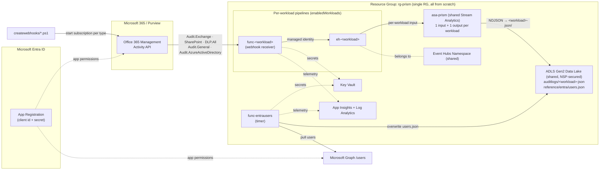
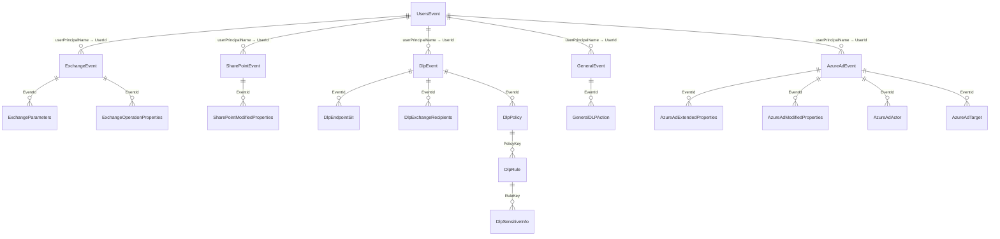

# PRISM (Purview Reporting & Insights System for Metadata) Proposal

> **Status:** Implemented. Infrastructure (Bicep + `azd`) and application code are
> provisioned **from scratch** in a **single resource group**. Which audit
> workloads deploy is controlled by the `enabledWorkloads` parameter
> (`infra/main.parameters.json`).
> This document describes the end-to-end flow and the Azure resources created.

---

## 1. Goal

Stream **Microsoft Purview / Microsoft 365 audit activity** (Exchange, SharePoint,
DLP, General, and Azure Active Directory) into an **Azure Data Lake (ADLS Gen2)**
so it can be queried, retained long-term, and consumed by downstream analytics /
SIEM tooling and Power BI.

The Office 365 Management Activity API does not push logs to a data lake directly. Instead it sends lightweight **webhook notifications** that point to content blobs. A small Azure Function pulls those blobs and forwards the records to an **Event Hub**. A **single, shared Azure Stream Analytics** job then drains every enabled hub — with one input and one output folder per workload — and lands **line-separated JSON (NDJSON)** in the **data lake** (Power BI reads these folders directly — no Avro decode).

### Per-content-type isolation (design principle)

Each enabled workload maps to **its own dedicated Azure Function App** and **its
own Event Hub**, and gets **its own input/output on the shared Stream Analytics
job**. All workloads land data in the
**same data lake storage account**, but each writes to a **separate blob path**,
keeping the streams fully isolated end-to-end. The set of deployed workloads is
driven by the `enabledWorkloads` array in `infra/main.parameters.json` (valid
values: `exchange`, `sharepoint`, `dlp`, `general`, `azuread`) — add an entry to
provision that pipeline. Note that `azd provision` is **incremental**, so
*removing* an entry does not delete the already-created resources; tear them down
explicitly or with `azd down`. The `entrausers` snapshot is always deployed and
is not part of this list.

| Script | Content type | Function App | Event Hub | ASA input → output | Data Lake blob path |
|--------|--------------|--------------|-----------|-------------------|---------------------|
| `CreateWebhookSubscription1.ps1` | `Audit.Exchange` | `func-exchange-<token>` | `eh-exchange` | `exchange-input → exchange-output` | `auditlogs/exchange-json/...` |
| `CreateWebhookSubscription2.ps1` | `Audit.SharePoint` | `func-sharepoint-<token>` | `eh-sharepoint` | `sharepoint-input → sharepoint-output` | `auditlogs/sharepoint-json/...` |
| `CreateWebhookSubscription3.ps1` | `DLP.All` | `func-dlp-<token>` | `eh-dlp` | `dlp-input → dlp-output` | `auditlogs/dlp-json/...` |
| `CreateWebhookSubscription4.ps1` | `Audit.General` | `func-general-<token>` | `eh-general` | `general-input → general-output` | `auditlogs/general-json/...` |
| `CreateWebhookSubscription5.ps1` | `Audit.AzureActiveDirectory` | `func-azuread-<token>` | `eh-azuread` | `azuread-input → azuread-output` | `auditlogs/azuread-json/...` |

> All inputs/outputs above live on **one shared** Stream Analytics job
> (`asa-prism-<token>`, 1 SU) — the streams never mix (separate inputs, outputs
> and consumer groups), but they share a single job to avoid paying the 1-SU
> floor per workload.

### Entra user snapshot (timer pipeline)

A separate **timer-triggered Function App** (`func-entrausers-<token>`) runs on a
schedule (not a webhook) and pulls **all Microsoft Entra users and their
properties** via **Microsoft Graph**, writing a **single blob** that is
**overwritten** each run so the file always holds the current, de-duplicated set
of users. It does **not** use an Event Hub — it writes directly to the shared data
lake via **managed identity**.

| Trigger | Source | Function App | Data Lake blob path | Write mode |
|---------|--------|--------------|---------------------|------------|
| Timer | Microsoft Graph `/users` | `func-entrausers-<token>` | `reference/entra/users.json` (single blob) | **Overwrite** (managed identity) |

---

## 2. High-Level Architecture



> The pipeline block is instantiated **once per entry** in `enabledWorkloads`
> (`exchange`, `sharepoint`, `dlp`, `general`, `azuread`). Removing an entry
> removes that workload's Function App, Event Hub, its input/output on the shared
> Stream Analytics job, and role assignments.

---

## 3. Proposal Flow (step by step)

> Each content type runs the **same flow** through its **own Function App** and **own Event Hub**, landing in a **separate blob path** of the **shared** data lake.

| # | Step | Component | Notes |
|---|------|-----------|-------|
| 0 | **Bootstrap subscriptions** | `createwebhooks/CreateWebhookSubscription{1..5}.ps1` | One-time (and on renewal). Each script calls `subscriptions/start` for its content type (`Audit.Exchange`, `Audit.SharePoint`, `DLP.All`, `Audit.General`, `Audit.AzureActiveDirectory`), pointing at **its own** Function App webhook URL. Run only the scripts for the workloads you enabled. |
| 1 | **Validation handshake** | Per-type Function | On subscription start, M365 sends a `validationtoken`; the Function echoes it back with `200 OK`. |
| 2 | **Notification received** | M365 → Function | M365 POSTs a JSON array of notifications (each with a `contentUri`) to the matching Function App. |
| 3 | **Pull content** | Function → Management API | Function acquires a token for `https://manage.office.com` using the **client secret** (Key Vault reference) and GETs each `contentUri`. |
| 4 | **Forward to Event Hub** | Function → its Event Hub | Records are batched and sent to the content-type's **dedicated** Event Hub using **managed identity** (Azure Event Hubs Data Sender; local SAS auth is disabled). |
| 5 | **Shape to Data Lake** | Stream Analytics → ADLS Gen2 | A **single shared Stream Analytics** job (`asa-prism-<token>`) drains every enabled Event Hub via a dedicated input and writes **line-separated JSON** into each workload's **own blob path** (`auditlogs/<type>-json/...`) in the **shared** data lake via managed identity. |
| 6 | **Consume** | Data Lake | Power BI (and downstream tools) read each content-type path independently from the same lake. |

### Entra user snapshot flow (4th pipeline)

| # | Step | Component | Notes |
|---|------|-----------|-------|
| A | **Daily trigger** | Timer (`func-prism-entrausers`) | NCRONTAB schedule, daily 02:00 UTC (`0 0 2 * * *`). |
| B | **Acquire Graph token** | Function → Entra | Token for `https://graph.microsoft.com/.default` using the **same** client secret / app id. |
| C | **Pull all users** | Function → Microsoft Graph | `GET /v1.0/users?$select=...` with **paging** (`@odata.nextLink`) to retrieve every user + selected properties. |
| D | **Overwrite blob** | Function → ADLS Gen2 | Serializes the full user set and **overwrites** `reference/entra/users.json` (via **managed identity**) so the blob always holds the current, unique users (no duplicates, no history). |

### Authentication model (as implemented)
- **Management API:** Entra **client secret** (the **same** app registration) — token for `manage.office.com`. The secret is stored in **Key Vault** and read via a Key Vault reference app setting.
- **Microsoft Graph (Entra users):** the **same** Entra **client secret / app id** — token for `graph.microsoft.com` (`User.Read.All`).
- **Event Hub:** **managed identity** (Azure Event Hubs Data Sender); namespace-level SAS auth is disabled (`disableLocalAuth`).
- **Data lake:** **managed identity** (Storage Blob Data Contributor) for both the Stream Analytics job and the Entra-users function; shared-key auth is disabled.
- Only the Entra **client secret** lives in **Key Vault**; every Azure-to-Azure hop uses managed identity (secretless).

> **One app registration for everything.** All Function Apps use the **same** Entra app id + client secret — it just needs both Office 365 Management API permissions and Microsoft Graph `User.Read.All` consented.

---

## 4. Azure Resources — single resource group, all from scratch

**Resource Group:** `rg-prism` (one region, e.g. `westeurope`). Everything below is created new. With all workloads enabled there are **six Function Apps** (five webhook receivers + one Entra-users snapshot) and **five Event Hubs**, but **one shared** Stream Analytics job, data lake, Event Hubs namespace, Key Vault, VNet, and monitoring stack. Counts marked *(per enabled workload)* scale with the `enabledWorkloads` array.

| # | Resource | Type (ARM) | Count | SKU / Tier | Purpose |
|---|----------|------------|-------|------------|---------|
| 1 | Resource Group | `Microsoft.Resources/resourceGroups` | 1 | — | Single container for all resources |
| 2 | Data Lake (ADLS Gen2) | `Microsoft.Storage/storageAccounts` | 1 (**shared**) | Standard_LRS, **HNS enabled** | NDJSON audit landing + Entra users snapshot blob. Public access **secured by Network Security Perimeter**. |
| 3 | Event Hubs Namespace | `Microsoft.EventHub/namespaces` | 1 (**shared**) | **Standard** | Hosts all workload Event Hubs |
| 4 | Event Hub | `Microsoft.EventHub/namespaces/eventhubs` | **1 per enabled workload** | 4 partitions | One stream per content type |
| 5 | Stream Analytics job | `Microsoft.StreamAnalytics/streamingjobs` | **1 (shared)** | Standard, 1 SU | Multi-input/output job; one input + output folder per workload |
| 6 | Function App | `Microsoft.Web/sites` (functionapp,linux) | **1 per enabled workload + 1** (entrausers) | **Flex Consumption (FC1)** | Webhook receivers + daily Entra-users snapshot |
| 7 | Function Plan | `Microsoft.Web/serverfarms` | **1 per Function App** | FC1 | One Flex plan per Function App |
| 8 | Function Storage | `Microsoft.Storage/storageAccounts` | **1 per Function App** | Standard_LRS | Runtime + deployment package per Function App |
| 9 | Key Vault | `Microsoft.KeyVault/vaults` | 1 (**shared**) | Standard | Entra client secret (via private endpoint) |
| 10 | Virtual Network + Private Endpoints | `Microsoft.Network/*` | 1 (**shared**) | — | Private connectivity for storage, Key Vault, Event Hubs |
| 10a | Network Security Perimeter | `Microsoft.Network/networkSecurityPerimeters` | 1 (**shared**) | — | Governs the Data Lake's public access: denies all inbound except allowed report-author IPs and in-subscription services (Stream Analytics); private endpoint traffic always allowed |
| 11 | Log Analytics Workspace | `Microsoft.OperationalInsights/workspaces` | 1 (**shared**) | PerGB2018 | Centralized logs |
| 12 | Application Insights | `Microsoft.Insights/components` | **1 per Function App** | — | Function monitoring |
| 13 | Managed Identity (system-assigned) | (on each Function / ASA job) | per resource | — | Secretless access to Key Vault, Event Hubs, data lake |

> **Outside the resource group (prerequisite, not created by IaC):**
> - **One shared Entra ID App Registration** (same app id + client secret for all Function Apps) with both **Office 365 Management API** permissions (`ActivityFeed.Read`, `ActivityFeed.ReadDlp`) **and Microsoft Graph** permission (`User.Read.All`, application) plus admin consent. `Audit.General` and `Audit.AzureActiveDirectory` are both covered by `ActivityFeed.Read` — no extra consent needed.

> **Note on Function Storage:** each Function App gets its own firewalled runtime
> storage account, reached over private endpoints via VNet integration, for full
> per-pipeline isolation.

---

## 5. Data Lake layout

The shared Stream Analytics job writes into the **same** ADLS Gen2 account but under
**separate top-level blob paths**, one per content type. Output is
**line-separated JSON (NDJSON)**, which Power BI parses directly:

```
container: auditlogs/
  exchange-json/    ...   <- exchange-output   (Audit.Exchange)
  sharepoint-json/  ...   <- sharepoint-output (Audit.SharePoint)
  dlp-json/         ...   <- dlp-output        (DLP.All)
  general-json/     ...   <- general-output    (Audit.General)
  azuread-json/     ...   <- azuread-output     (Audit.AzureActiveDirectory)

container: reference/
  entra/users.json        <- daily snapshot, OVERWRITTEN each run
```

- The audit streams **append** (immutable, partitioned by date — one daily folder `…/<workload>-json/yyyy/MM/dd/`); the Entra users blob is a **single file overwritten daily** so it always holds the current unique user set.
- Only the paths for **enabled** workloads are produced.
- Apply **lifecycle management** on the storage account to tier/expire old data. The `reference/entra/` blob is excluded from expiry since it is always the latest snapshot.

---

## 6. Power BI data model

Power BI reads the NDJSON folders (and the Entra users snapshot) directly from the
data lake. The Power Query (M) definitions live in `PBI-Mquerys/` (one file per
query, referenced by name). The model is a **star-ish schema**: one **fact per
workload**, per-workload **child tables** for the array-of-record fields, and a
single shared **`UsersEvent` dimension**.

### Query tiers

| Tier | Load | Queries |
|------|------|---------|
| Parameter | — | `DataLakeAccountName`, `LoadDays` |
| Helper function | OFF | `fnExpandAllRecords` |
| Staging (base) | OFF | `ExchangeStaging`, `SharePointStaging`, `DlpStaging`, `GeneralStaging`, `AzureAdStaging`, `UsersStaging` |
| Facts | ON | `ExchangeEvent`, `SharePointEvent`, `DlpEvent`, `GeneralEvent`, `AzureAdEvent`, `UsersEvent` |
| Children | ON | `ExchangeParameters`, `ExchangeOperationProperties`, `SharePointModifiedProperties`, `DlpEndpointSit`, `DlpExchangeRecipients`, `DlpPolicy`, `DlpRule`, `DlpSensitiveInfo`, `GeneralDLPAction`, `AzureAdExtendedProperties`, `AzureAdModifiedProperties`, `AzureAdActor`, `AzureAdTarget` |

Each `*Staging` query parses its folder once and keeps the raw record; the fact
query expands scalars + 1:1 records and **drops array-of-record columns**, which
the child queries re-expand (one row per element, keyed by `EventId`).

### Relationships

All relationships are **one-to-many (1 → \*)**, single cross-filter direction,
from the `1` side to the child. Build only the ones for workloads you enabled.

| Parent (1) · key | Child (\*) · key |
|------------------|------------------|
| `ExchangeEvent[EventId]` | `ExchangeParameters[EventId]` |
| `ExchangeEvent[EventId]` | `ExchangeOperationProperties[EventId]` |
| `SharePointEvent[EventId]` | `SharePointModifiedProperties[EventId]` |
| `DlpEvent[EventId]` | `DlpEndpointSit[EventId]` |
| `DlpEvent[EventId]` | `DlpExchangeRecipients[EventId]` |
| `DlpEvent[EventId]` | `DlpPolicy[EventId]` |
| `DlpPolicy[PolicyKey]` | `DlpRule[PolicyKey]` |
| `DlpRule[RuleKey]` | `DlpSensitiveInfo[RuleKey]` |
| `GeneralEvent[EventId]` | `GeneralDLPAction[EventId]` |
| `AzureAdEvent[EventId]` | `AzureAdExtendedProperties[EventId]` |
| `AzureAdEvent[EventId]` | `AzureAdModifiedProperties[EventId]` |
| `AzureAdEvent[EventId]` | `AzureAdActor[EventId]` |
| `AzureAdEvent[EventId]` | `AzureAdTarget[EventId]` |
| `UsersEvent[userPrincipalName]` | `ExchangeEvent[UserId]` |
| `UsersEvent[userPrincipalName]` | `SharePointEvent[UserId]` |
| `UsersEvent[userPrincipalName]` | `DlpEvent[UserId]` |
| `UsersEvent[userPrincipalName]` | `GeneralEvent[UserId]` |
| `UsersEvent[userPrincipalName]` | `AzureAdEvent[UserId]` |

`UsersEvent` is the shared **user dimension**: `userPrincipalName` maps
one-to-many to each fact's `UserId`, so one user filter slices every workload.
The workload facts stay independent of one another (linked only through
`UsersEvent`).



---

## 7. Adding or removing a workload

The set of deployed pipelines is data-driven. To change it:

1. Edit `enabledWorkloads` in `infra/main.parameters.json` (valid values:
   `exchange`, `sharepoint`, `dlp`, `general`, `azuread`).
2. Re-run `azd up` (or `azd provision`). This is an **incremental** deployment:
   newly added workloads are created, but workloads you removed from
   `enabledWorkloads` are **not** deleted automatically — their Function App,
   Event Hub, Stream Analytics input/output and role assignments remain and keep
   incurring cost until you remove them explicitly (delete the resources via the
   portal/CLI, or run `azd down` to tear down the whole environment).
3. For a newly added workload, run its `createwebhooks/CreateWebhookSubscription*.ps1`
   once to start the Office 365 Management API subscription.
4. In Power BI, add the workload's staging/fact/child queries and relationships
   (section 6), or omit them for disabled workloads.

To support a brand-new content type end-to-end, add an entry to `allWorkloads`
in `infra/modules/resources.bicep`, create `src/<service>/` (copy an existing
webhook function), register the service in `azure.yaml`, add a webhook bootstrap
script, and add the matching `PBI-Mquerys/` queries.
