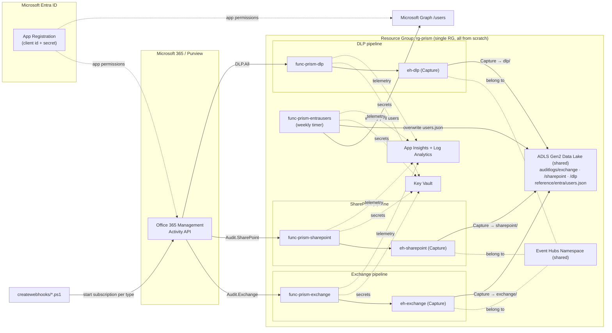

# PRISM (Purview Reporting & Insights System for Metadata) Proposal

> **Status:** Proposal / Design only. No infrastructure or application code is provisioned yet.
> This document describes the end-to-end flow and the Azure resources to be created **from scratch** in a **single resource group**.

---

## ⚠️ Security Notice (action required before anything else)

The three scripts in `createwebhooks/` previously contained a **hard-coded client secret** in plaintext:

```
$clientSecret = "<REDACTED>"   # createwebhooks/CreateWebhookSubscription1.ps1, 2, 3
```

**Required actions:**

1. **Rotate / revoke** this client secret in Microsoft Entra ID immediately — assume it is compromised.
2. Never commit secrets to source control. The new secret must live in **Key Vault** or Function **app settings**, not in code.
3. Add `local.settings.json` and any `*.secrets.*` files to `.gitignore`.

---

## 1. Goal

Stream **Microsoft Purview / Microsoft 365 audit activity** (Exchange, SharePoint, DLP, etc.) into an **Azure Data Lake (ADLS Gen2)** so it can be queried, retained long-term, and consumed by downstream analytics / SIEM tooling.

The Office 365 Management Activity API does not push logs to a data lake directly. Instead it sends lightweight **webhook notifications** that point to content blobs. A small Azure Function pulls those blobs and forwards the records to an **Event Hub**, whose built-in **Capture** feature lands the data in the **data lake** automatically.

### Per-content-type isolation (design principle)

Each of the three subscription scripts in `createwebhooks/` maps to **its own dedicated Azure Function App** and **its own Event Hub**. All three land data in the **same data lake storage account**, but each writes to a **separate blob path / container**, keeping the streams fully isolated end-to-end:

| Script | Content type | Function App | Event Hub | Data Lake blob path |
|--------|--------------|--------------|-----------|---------------------|
| `CreateWebhookSubscription1.ps1` | `Audit.Exchange` | `func-prism-exchange` | `eh-exchange` | `auditlogs/exchange/...` |
| `CreateWebhookSubscription2.ps1` | `Audit.SharePoint` | `func-prism-sharepoint` | `eh-sharepoint` | `auditlogs/sharepoint/...` |
| `CreateWebhookSubscription3.ps1` | `DLP.All` | `func-prism-dlp` | `eh-dlp` | `auditlogs/dlp/...` |

### Entra user snapshot (4th pipeline)

A **fourth Function App** runs on a **weekly timer** (not a webhook) and pulls **all Microsoft Entra users and their properties** via **Microsoft Graph**, writing a **single blob** that is **overwritten** each run so the file always holds the current, de-duplicated set of users. It does **not** use an Event Hub — it writes directly to the shared data lake.

| Trigger | Source | Function App | Data Lake blob path | Write mode |
|---------|--------|--------------|---------------------|------------|
| Timer (weekly) | Microsoft Graph `/users` | `func-prism-entrausers` | `reference/entra/users.json` (single blob) | **Overwrite** (unique snapshot, via connection string) |

---

## 2. High-Level Architecture



---

## 3. Proposal Flow (step by step)

> Each content type runs the **same flow** through its **own Function App** and **own Event Hub**, landing in a **separate blob path** of the **shared** data lake.

| # | Step | Component | Notes |
|---|------|-----------|-------|
| 0 | **Bootstrap subscriptions** | `createwebhooks/CreateWebhookSubscription{1,2,3}.ps1` | One-time (and on renewal). Each script calls `subscriptions/start` for its content type (`Audit.Exchange`, `Audit.SharePoint`, `DLP.All`), pointing at **its own** Function App webhook URL. |
| 1 | **Validation handshake** | Per-type Function | On subscription start, M365 sends a `validationtoken`; the Function echoes it back with `200 OK`. |
| 2 | **Notification received** | M365 → Function | M365 POSTs a JSON array of notifications (each with a `contentUri`) to the matching Function App. |
| 3 | **Pull content** | Function → Management API | Function acquires a token for `https://manage.office.com/.default` using the **client secret** and GETs each `contentUri`. |
| 4 | **Forward to Event Hub** | Function → its Event Hub | Records are batched and sent to the content-type's **dedicated** Event Hub using its **connection string**. |
| 5 | **Capture to Data Lake** | Event Hub → ADLS Gen2 | Each Event Hub's **Capture** writes Avro into its **own blob path** (`auditlogs/{type}/...`) in the **shared** data lake — no extra code. |
| 6 | **Consume** | Data Lake | Downstream tools read each content-type path independently from the same lake. |

### Entra user snapshot flow (4th pipeline)

| # | Step | Component | Notes |
|---|------|-----------|-------|
| A | **Weekly trigger** | Timer (`func-prism-entrausers`) | NCRONTAB schedule, e.g. every Monday 02:00 UTC (`0 0 2 * * 1`). |
| B | **Acquire Graph token** | Function → Entra | Token for `https://graph.microsoft.com/.default` using the **same** client secret / app id. |
| C | **Pull all users** | Function → Microsoft Graph | `GET /v1.0/users?$select=...` with **paging** (`@odata.nextLink`) to retrieve every user + selected properties. |
| D | **Overwrite blob** | Function → ADLS Gen2 | Serializes the full user set and **overwrites** `reference/entra/users.json` (via storage **connection string**) so the blob always holds the current, unique users (no duplicates, no history). |

### Authentication model (as confirmed)
- **Management API:** Entra **client secret** (the **same** app registration) — token for `manage.office.com`.
- **Microsoft Graph (Entra users):** the **same** Entra **client secret / app id** — token for `graph.microsoft.com` (`User.Read.All`).
- **Event Hub:** **connection string** (namespace shared access policy).
- **Data lake (Entra users blob):** storage account **connection string** (consistent with the rest of the solution).
- All secrets (client secret, EH connection strings, data lake connection string) are proposed to be stored in **Key Vault** and referenced by the Functions (not in source).

> **One app registration for everything.** All four Function Apps use the **same** Entra app id + client secret — it just needs both Office 365 Management API permissions and Microsoft Graph `User.Read.All` consented.

---

## 4. Azure Resources — single resource group, all from scratch

**Resource Group:** `rg-prism` (one region, e.g. `westeurope`). Everything below is created new. There are **four Function Apps** (three webhook receivers + one weekly Entra-users snapshot) and **three Event Hubs**, but **one shared** data lake, Event Hubs namespace, Key Vault, and monitoring stack.

| # | Resource | Type (ARM) | Count | SKU / Tier | Purpose |
|---|----------|------------|-------|------------|---------|
| 1 | Resource Group | `Microsoft.Resources/resourceGroups` | 1 | — | Single container for all resources |
| 2 | Data Lake (ADLS Gen2) | `Microsoft.Storage/storageAccounts` | 1 (**shared**) | Standard_LRS, **HNS enabled** | Capture destination + Entra users snapshot blob |
| 3 | Event Hubs Namespace | `Microsoft.EventHub/namespaces` | 1 (**shared**) | **Standard** (Capture requires Standard+) | Hosts all three Event Hubs |
| 4 | Event Hub | `Microsoft.EventHub/namespaces/eventhubs` | **3** (`eh-exchange`, `eh-sharepoint`, `eh-dlp`) | 1–4 partitions, Capture **on** | One stream per content type → its own blob path |
| 5 | Function App | `Microsoft.Web/sites` (functionapp,linux) | **4** (exchange, sharepoint, dlp, entrausers) | **Flex Consumption (FC1)** | 3 webhook receivers + 1 weekly Entra-users snapshot |
| 6 | Function Plan | `Microsoft.Web/serverfarms` | **4** | FC1 | One Flex plan per Function App |
| 7 | Function Storage | `Microsoft.Storage/storageAccounts` | **4** | Standard_LRS | Runtime + deployment package per Function App |
| 8 | Key Vault | `Microsoft.KeyVault/vaults` | 1 (**shared**) | Standard | Client secret + the three EH connection strings + data lake connection string |
| 9 | Log Analytics Workspace | `Microsoft.OperationalInsights/workspaces` | 1 (**shared**) | PerGB2018 | Centralized logs |
| 10 | Application Insights | `Microsoft.Insights/components` | 1 or 4 | — | Function monitoring (shared instance, or one per app) |
| 11 | Managed Identity (system-assigned) | (on each Function) | 4 | — | Function → Key Vault access (read secrets) |

> **Outside the resource group (prerequisite, not created by IaC):**
> - **One shared Entra ID App Registration** (same app id + client secret for all four Function Apps) with both **Office 365 Management API** permissions (`ActivityFeed.Read`, `ActivityFeed.ReadDlp`) **and Microsoft Graph** permission (`User.Read.All`, application) plus admin consent. Created once in the tenant and referenced by client id/secret.

> **Note on Function Storage:** A single shared runtime storage account *can* host all three Function Apps (using distinct content shares), which lowers cost. Three separate accounts give stronger isolation. Defaulting to **3** for full per-pipeline isolation — confirm in section 6.

---

## 5. Data Lake layout (proposed)

All three Event Hubs capture into the **same** ADLS Gen2 account but under **separate top-level blob paths**, one per content type:

```
container: auditlogs/
  exchange/   {yyyy}/{MM}/{dd}/{HH}/{partition}_{timestamp}.avro   <- eh-exchange Capture
  sharepoint/ {yyyy}/{MM}/{dd}/{HH}/{partition}_{timestamp}.avro   <- eh-sharepoint Capture
  dlp/        {yyyy}/{MM}/{dd}/{HH}/{partition}_{timestamp}.avro   <- eh-dlp Capture

container: reference/
  entra/users.json                                                <- weekly snapshot, OVERWRITTEN each run
```

- The three audit streams **append** (immutable, partitioned by date/hour); the Entra users blob is a **single file overwritten weekly** so it always holds the current unique user set.
- Each Event Hub's **Capture path format** is set so its files land under the matching `exchange/`, `sharepoint/`, or `dlp/` prefix.
- Partition by date/hour for efficient downstream querying and lifecycle management.
- Apply **lifecycle management** on the storage account to tier/expire old data (e.g., cool after 90 days, delete after retention period) — rules can differ per prefix. The `reference/entra/` blob is excluded from expiry since it is always the latest snapshot.

---

## 6. Open decisions (to confirm before build)

1. **Region** for the resource group (default suggestion: `westeurope`).
2. **Function runtime storage:** one **shared** account for all three Function Apps (lower cost) vs. **three separate** accounts (full isolation, current default).
3. **Application Insights:** one **shared** instance vs. **one per Function App**.
4. **Capture format** — Avro (native) vs. post-processing to Parquet/JSON in the lake.
5. **Retention** policy on the data lake (per content-type prefix).
6. **Downstream consumer** of the lake (Fabric / Synapse / Databricks / ADX / SIEM connector).
7. Keep **connection string** for Event Hub, or switch to **managed identity** later for a secretless design.

---

## 7. Proposed build sequence (next phase — not done yet)

1. Provision the resource group + all resources via **Bicep + `azd`** (single deployment): shared data lake, Event Hubs namespace, Key Vault, monitoring, plus **4 Function Apps** and **3 Event Hubs** with Capture mapped to their blob paths.
2. Refactor `scriptwebhook.py` into a reusable **Azure Functions v2** app (`function_app.py`, `host.json`), deployed as the **three** webhook Function Apps, each configured (via app settings) for its content type and target Event Hub.
3. Add the **4th Function App** (`func-prism-entrausers`): a **timer-triggered** function that pages Microsoft Graph `/users` and **overwrites** `reference/entra/users.json` in the data lake.
4. Move secrets to **Key Vault**; wire app settings (client secret + the three EH connection strings).
5. Update the three `createwebhooks/*.ps1` scripts so each points at its **own** Function App webhook URL.
6. Enable **Event Hubs Capture** on each Event Hub to its `auditlogs/{type}/` path in the shared data lake.
7. Validate each pipeline end-to-end (handshake → notification → blob pull → Event Hub → lake path) and the weekly Entra users snapshot (timer → Graph → overwritten blob).

> Approve this proposal (and the open decisions in section 6) and I will generate the infrastructure and application code.
